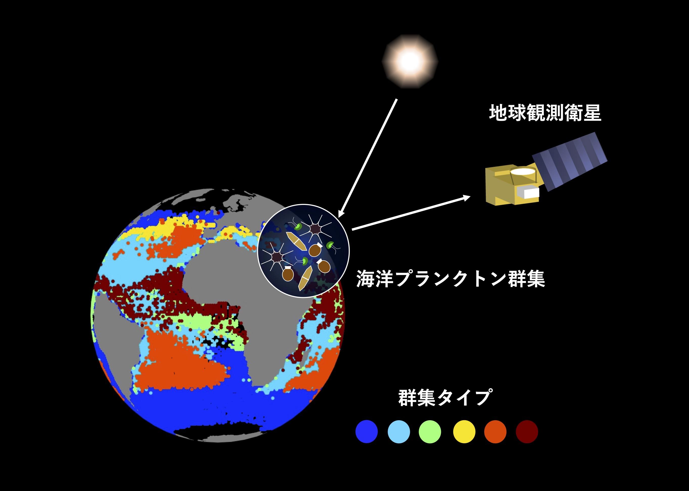
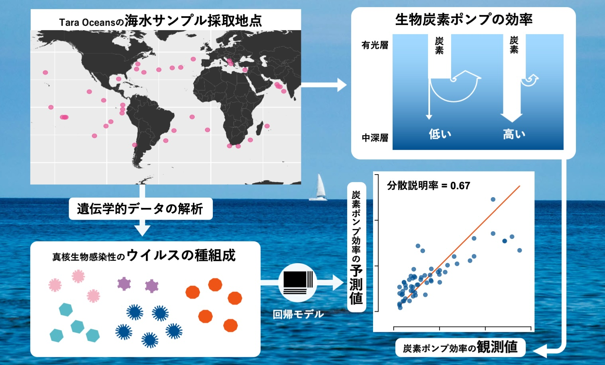

# 研究内容

## Plankton From Satellite

海洋微生物群集をタイプ分けし、それを衛星で捉えた海色・海水温から予測するモデルを開発した

* 論文: [Kaneko H, et al. 2023. Predicting global distributions of eukaryotic plankton communities from satellite data. ISME Commun 3:101](https://doi.org/10.1038/s43705-023-00308-7)
* Github: [plankton-from-satellite](https://github.com/hirotokaneko/plankton-from-satellite)
* プレスリリース: [京都大学 - プランクトンを宇宙から観測する](https://www.kyoto-u.ac.jp/ja/research-news/2023-10-19-2)

## Viruses And Carbon Export

海洋における炭素の鉛直輸送効率を、ウイルスの種組成から予測できることを明らかにした

* 論文: [Kaneko H, et al. 2021. Eukaryotic virus composition can predict the efficiency of carbon export in the global ocean. iScience 24(1):102002](https://doi.org/10.1016/j.isci.2020.102002)
* プレスリリース: [京都大学 - 海洋ウイルスの種組成と炭素の鉛直輸送の相関を確認](https://www.kyoto-u.ac.jp/ja/research-news/2021-01-15)

## Others
そのほかの研究は下記リンクより

* ORCID: [Hiroto Kaneko](https://orcid.org/0000-0002-7127-2551)

[back](./)
